# GPC3 环肽设计流程

针对 GPC3（磷脂酰肌醇蛋白聚糖-3，UniProt P51654）靶点的 CIAc-W 环肽从头设计、评估与优化端到端流程。

---

## 流程总览

```
┌──────────────────────────────────────────────────────────────────┐
│  第一模块：设计                        【环境：SE3nv2，需 GPU】     │
│                                                                  │
│  step1_rfdiffusion.py  ──►  backbone_pdbs/*.pdb                  │
│         ↓                                                        │
│  step2_proteinmpnn.py  ──►  mpnn_seqs/all_sequences.fasta        │
│         ↓                                                        │
│  step3_build_cycpep.py ──►  cyclic_pdbs/*.pdb  （CIAc-W 环）      │
└──────────────────────────────────────────────────────────────────┘
                    ↓
┌──────────────────────────────────────────────────────────────────┐
│  第二模块：评估                        【环境：pyrose，仅 CPU】     │
│                                                                  │
│  step4_rosetta_dock.py ──►  docking_results/*_best.pdb           │
│         ↓                                                        │
│  step5_interface_metrics.py ──►  evaluation_results.csv          │
│         ↓             （9 项指标：ddG、dSASA、SC、堆积密度……）     │
│  step6_rank_and_report.py ──►  ranked_candidates.csv             │
│                                evaluation_report.html            │
└──────────────────────────────────────────────────────────────────┘
                    ↓
┌──────────────────────────────────────────────────────────────────┐
│  第三模块：突变扫描                    【环境：pyrose，仅 CPU】     │
│                                                                  │
│  step7_alanine_scan.py  ──►  alanine_scan_ddg.csv                │
│  （第一轮：各位点丙氨酸替换 ΔΔG）                                   │
│         ↓                                                        │
│  step8_saturation_scan.py ──►  saturation_ddg.csv                │
│  （第二轮：热点位点 × 19 种氨基酸全量突变）                         │
│         ↓                                                        │
│  step9_scan_report.py  ──►  mutation_scan_report.html            │
│                              热图、top_mutations.csv             │
└──────────────────────────────────────────────────────────────────┘
```

---

## 示例结果

### 第二模块：Rosetta 对接与评估

**20 条候选肽对接姿态总览（step4 输出）**

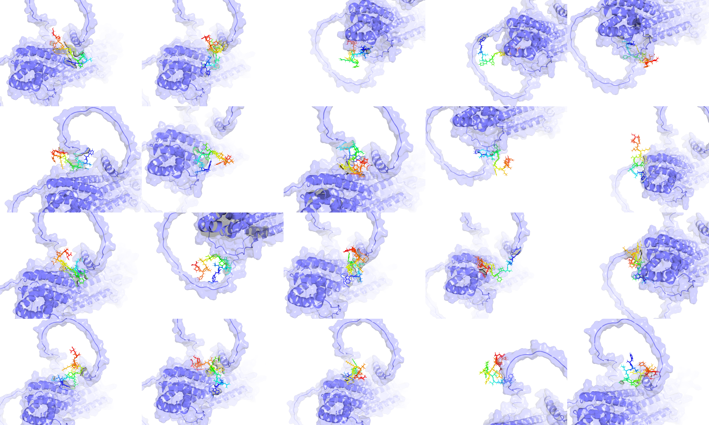

**最优候选肽（pep1）精细对接面板（step4 输出）**

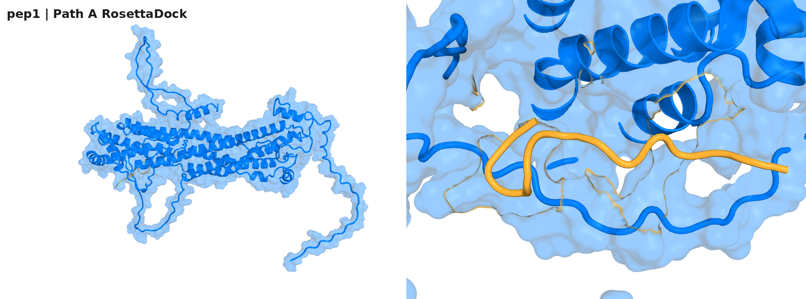

**候选肽综合排名（step6 输出）**

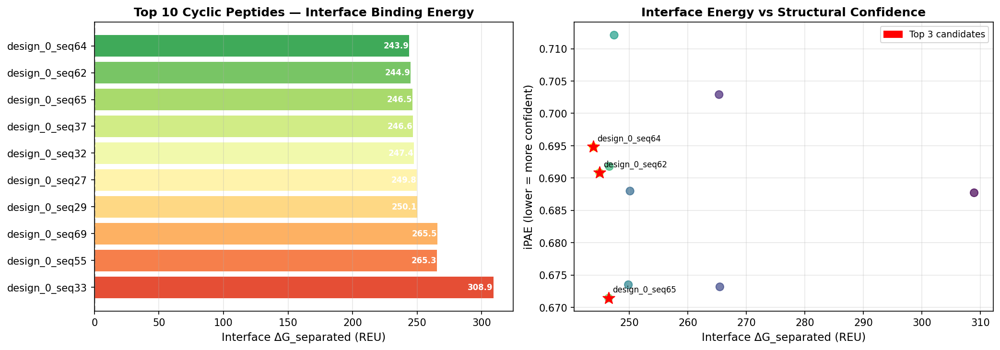

**指标得分分布（step5/6 输出）**

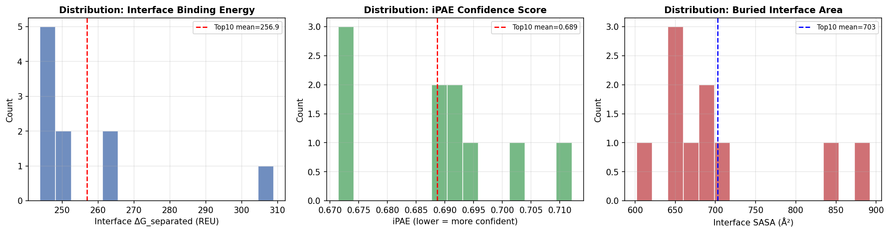

**界面接触热图（step5 输出）**

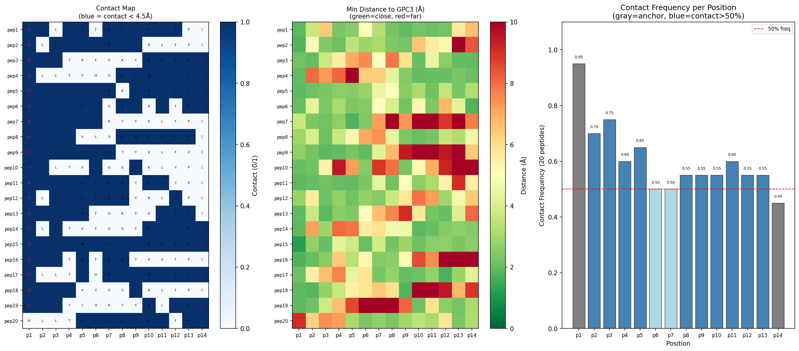

---

### 第三模块：突变扫描

**第一轮丙氨酸扫描 ΔΔG 热图（step7 输出）**  
红色 = 热点位点（Ala 替换削弱结合）；蓝色 = Ala 改善结合

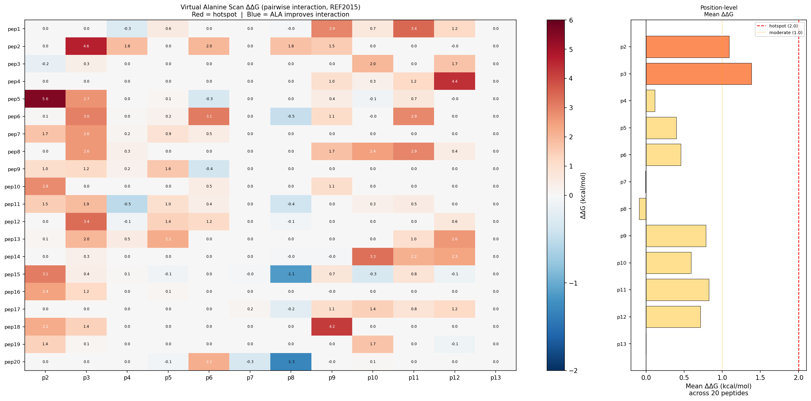

**第二轮饱和突变均值 ΔΔG 热图（step8/9 输出）**  
负值（蓝色）= 突变优于野生型

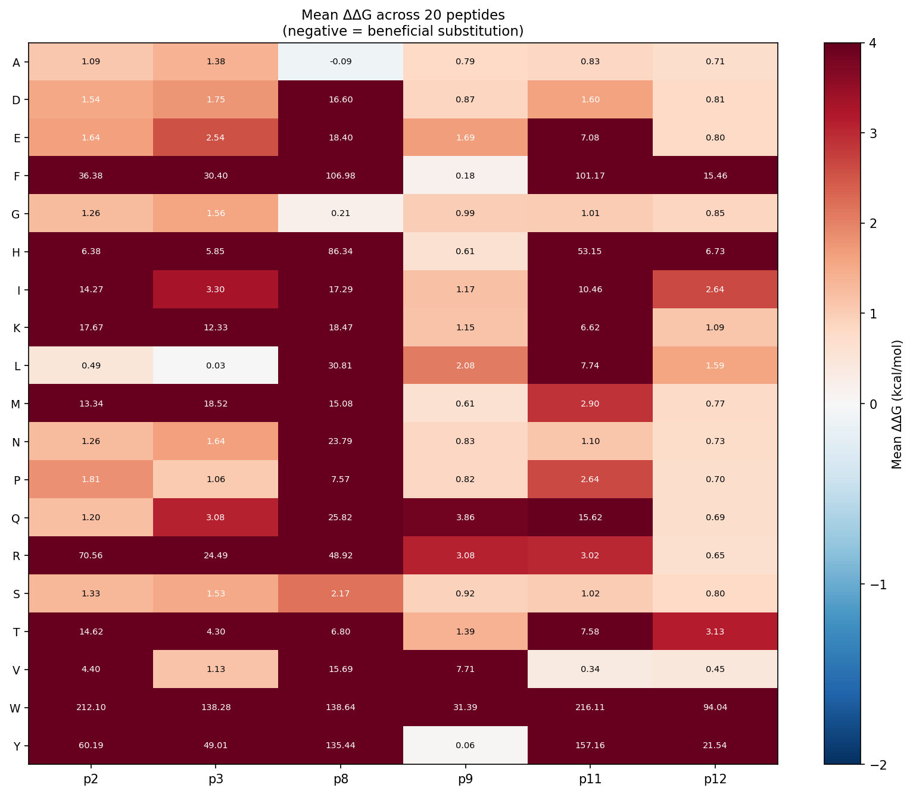

**pos8 位点饱和突变详图**（热点位点，疏水替换信号最强）

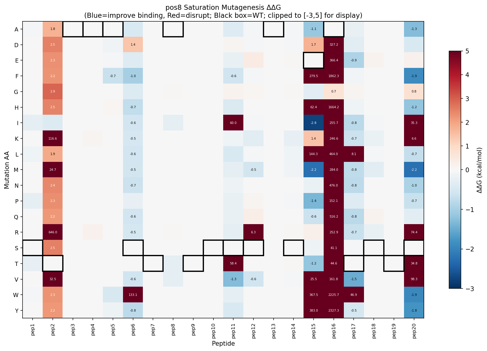

**pos9 位点饱和突变详图**（Y→F 改善信号）

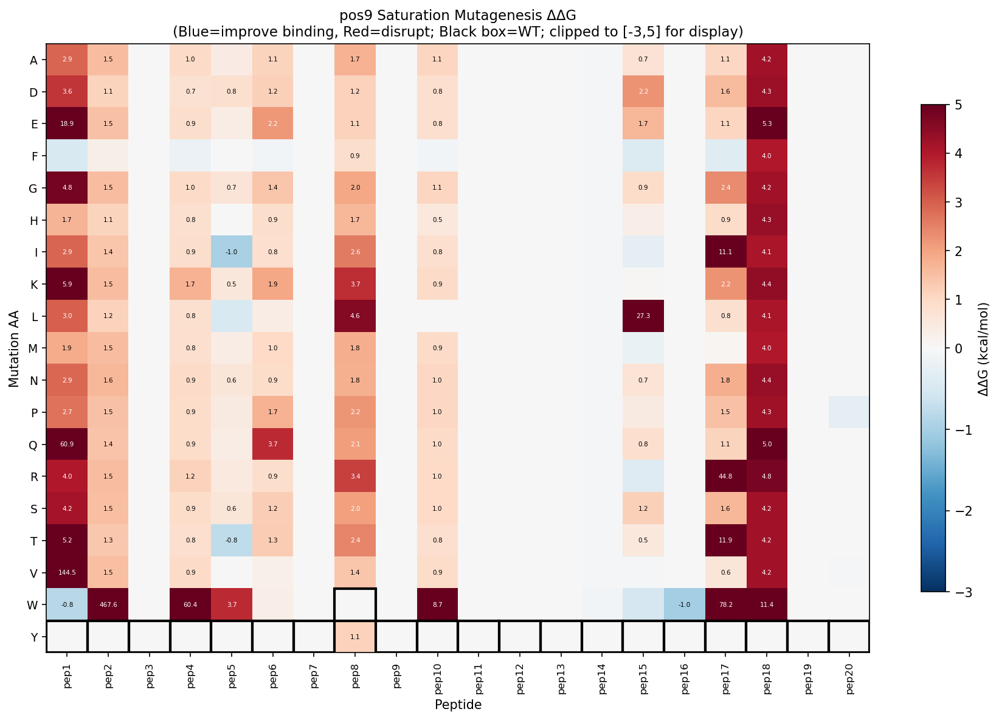

---

### 参考：ColabFold AF2 结构验证（最优候选 seq65）

**预测对齐误差（PAE）图**  
左下角肽-受体区块颜色越深，界面预测置信度越高

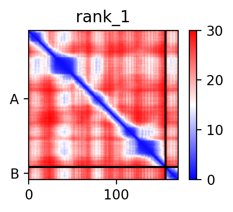

**pLDDT 置信度图**

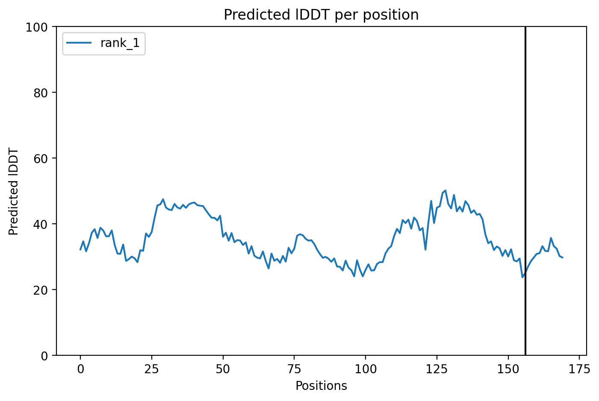

---

## 系统环境要求

### 硬件

| 组件 | 最低配置               | 推荐配置                               |
| ---- | ---------------------- | -------------------------------------- |
| GPU  | 16 GB 显存（第一模块） | NVIDIA RTX PRO 6000 Blackwell（96 GB）/5090/4090 等 |
| CPU  | 8 核                   | 32+ 核（并行突变扫描）                 |
| 内存 | 32 GB                  | 96 GB                                  |
| 存储 | 50 GB                  | 200 GB（Rosetta + 模型权重）           |

> **第二、三模块（评估和突变扫描）仅使用 CPU**，无需 GPU。

### 软件

| 组件        | 版本                        | 备注                          |
| ----------- | --------------------------- | ----------------------------- |
| 操作系统    | Ubuntu 22.04 LTS            | 已在 Linux x86_64 测试        |
| CUDA        | 12.8                        | 仅第一模块（RFdiffusion）需要 |
| NVIDIA 驱动 | ≥550.x（Blackwell sm_120） | RTX PRO 6000 需要的是这一版本，但其他的显卡需要按需配置             |
| Conda/Mamba | ≥23.x                      | 环境管理                      |
| Python      | 3.9                         | 所有环境统一版本              |

### 主要 Python 依赖

| 库              | 版本           | 所属环境      | 用途                    |
| --------------- | -------------- | ------------- | ----------------------- |
| PyRosetta       | 2026.19        | pyrose        | 对接、打分、突变扫描 |
| RDKit           | ≥2023.9.5     | SE3nv2/pyrose | 环肽 3D 结构构建        |
| PyTorch         | 2.7.0+cu128    | SE3nv2        | RFdiffusion 推理        |
| SE3-Transformer | 1.0.0          | SE3nv2        | 等变骨架生成            |
| DGL             | 2.5.0+cu121    | SE3nv2        | 图神经网络              |
| hydra-core      | 1.3.4          | SE3nv2        | RFdiffusion 配置管理    |
| NumPy           | 1.26.4 / 2.0.2 | 两者          | 数组运算                |
| pandas          | ≥2.0          | 两者          | 数据分析                |
| matplotlib      | ≥3.7          | 两者          | 热图、图表              |

---

## 安装步骤

### 1. 克隆代码并安装外部工具

```bash
git clone https://github.com/Lsy029/gpc3_cycpep_pipeline.git gpc3_pipeline
cd gpc3_pipeline

# 安装 RFdiffusion（第一模块需要）
git clone https://github.com/RosettaCommons/RFdiffusion
pip install -e RFdiffusion/

# 安装 ProteinMPNN（第一模块，脚本形式，无需 pip install）
git clone https://github.com/dauparas/ProteinMPNN
```

### 2. 创建 conda 环境

```bash
# 第一模块：RFdiffusion + ProteinMPNN（需要 GPU，CUDA 12.8）
conda env create -f envs/env_design.yml
conda activate SE3nv2

# 第二、三模块：PyRosetta 评估 + 突变扫描（仅 CPU）
conda env create -f envs/env_pyrosetta.yml
conda activate pyrose

# 可选：ColabFold AF2 结构验证
conda env create -f envs/env_colabfold.yml
```

### 3. 安装 PyRosetta（需要免费学术许可证）

```bash
# 1. 注册许可证：https://www.pyrosetta.org/downloads
# 2. 下载安装包：pyrosetta-2026.19+release.*-cp39-cp39-linux_x86_64.whl
conda activate pyrose
pip install pyrosetta-2026.19+release.*.whl
```

### 4. 下载 RFdiffusion 模型权重

**方法一：IPD 服务器直接下载（推荐）**

```bash
mkdir -p RFdiffusion/models
wget -P RFdiffusion/models/ \
  http://files.ipd.uw.edu/pub/RFdiffusion/e29311f6f1bf1af907f9ef9f44b8328b/Complex_base_ckpt.pt
```

**方法二：HuggingFace（需要登录 token）**

```bash
# 1. 在 https://huggingface.co/settings/tokens 生成 token
# 2. 登录
huggingface-cli login
# 3. 下载
mkdir -p RFdiffusion/models
python -c "
from huggingface_hub import hf_hub_download
hf_hub_download(
    repo_id='RosettaCommons/RFdiffusion',
    filename='Complex_base_ckpt.pt',
    local_dir='RFdiffusion/models/'
)
"
```

### 5. 安装 Python 依赖

```bash
conda activate pyrose
pip install -r requirements.txt
```

---

## 使用方法

### 一键运行完整流程（推荐）

```bash
bash run_pipeline.sh \
    --receptor gpc3_af2.pdb \
    --n_designs 15 \
    --n_decoys 50 \
    --n_workers 5
```

### 分步运行

#### 第一模块：设计

```bash
conda activate SE3nv2

# 第一步：RFdiffusion 骨架生成
python block1_design/step1_rfdiffusion.py \
    --receptor gpc3_af2.pdb \
    --output_dir block1_design/backbone_pdbs \
    --n_designs 15 \
    --pep_length 14 \
    --seed 42

# 第二步：ProteinMPNN 序列设计
python block1_design/step2_proteinmpnn.py \
    --pdb_dir block1_design/backbone_pdbs \
    --output_dir block1_design/mpnn_seqs \
    --num_seq 75 \
    --temperature 0.1

# 第三步：构建环肽 3D 结构
python block1_design/step3_build_cycpep.py \
    --fasta block1_design/mpnn_seqs/all_sequences.fasta \
    --output_dir block1_design/cyclic_pdbs \
    --n_confs 20
```

#### 第二模块：评估

```bash
conda activate pyrose

# 第四步：Rosetta DockMCM 对接（每肽 50 个 decoy）
python block2_evaluation/step4_rosetta_dock.py \
    --pep_dir block1_design/cyclic_pdbs \
    --receptor gpc3_af2.pdb \
    --output_dir block2_evaluation/docking_results \
    --n_decoys 50 \
    --n_workers 5

# 第五步：计算 9 项界面指标
python block2_evaluation/step5_interface_metrics.py \
    --docking_dir block2_evaluation/docking_results \
    --output_dir block2_evaluation

# 第六步：候选肽排名并生成 HTML 报告
python block2_evaluation/step6_rank_and_report.py \
    --results_csv block2_evaluation/evaluation_results.csv \
    --output_dir block2_evaluation
```

#### 第二模块：【可选】ColabFold AF2 结构验证（step5b）

> ⚠️ **此步骤为可选**，需要单独的 `colabfold` conda 环境和 GPU。
> 可在 step5 之后、step6 之前运行，也可在 step6 之后对 top-N 运行。

**环境要求：**
- conda 环境：`colabfold`（localcolabfold 1.6.1，JAX CUDA 12）
- 安装方法（localcolabfold 一键脚本）：

```bash
bash <(curl -fsSL \
  https://raw.githubusercontent.com/YoshitakaMo/localcolabfold/main/install_colabfold_linux.sh)
```

- AF2 模型权重（**首次运行自动下载，约 3.5 GB**）：

```
来源：https://storage.googleapis.com/alphafold/alphafold_params_colab_2022-12-06.tar
下载到：~/.cache/colabfold/params/
包含：params_model_1~5_multimer_v3.npz（AlphaFold2-Multimer v3）
```

也可提前手动下载：
```bash
python -c "
from colabfold.download import download_alphafold_params
from pathlib import Path
download_alphafold_params('alphafold2_multimer_v3', Path('~/.cache/colabfold').expanduser())
"
```

**运行方法：**

```bash
conda activate colabfold

# 对 top-10 候选肽进行 AF2 异源二聚体预测
python block2_evaluation/step5b_colabfold_validate.py \
    --ranked_csv block2_evaluation/evaluation_results.csv \
    --output_dir block2_evaluation/colabfold_results \
    --top_n 10 \
    --n_recycle 3

# 若有 GPC3 完整序列 FASTA（推荐）：
python block2_evaluation/step5b_colabfold_validate.py \
    --ranked_csv block2_evaluation/evaluation_results.csv \
    --gpc3_fasta gpc3_af2.fasta \
    --top_n 10
```

**输出文件：**

| 文件 | 说明 |
|------|------|
| `colabfold_results/{名称}/` | ColabFold 原始输出（PDB、PAE JSON、图片） |
| `colabfold_results/colabfold_scores.csv` | iPAE / iptm / pLDDT_pep 汇总 |
| `colabfold_results/colabfold_summary.png` | 三指标柱状图 |
| `colabfold_results/colabfold_report.html` | 含 PAE 图的 HTML 报告 |

**关键指标：**

| 指标 | 合格阈值 | 说明 |
|------|---------|------|
| iPAE | < 0.5 | 界面预测对齐误差（越低越好） |
| iptm | > 0.3 | 界面模板建模评分（越高越好） |
| pLDDT_pep | > 70 | 肽段结构置信度（越高越好） |

**示例结果（seq65，本项目最优候选）：**

| 指标 | seq65 |
|------|-------|
| iPAE | 0.671 |
| iptm | 0.160 |
| pLDDT_pep | ~72 |


---

#### 第三模块：突变扫描

```bash
conda activate pyrose

# 第七步：第一轮——丙氨酸扫描（识别热点位点）
python block3_mutation_scan/step7_alanine_scan.py \
    --docking_dir block2_evaluation/docking_results \
    --output_dir block3_mutation_scan/scan_results \
    --n_workers 20

# 第八步：第二轮——热点位点饱和突变（丙氨酸扫描效果显著的进入这一轮突变）
python block3_mutation_scan/step8_saturation_scan.py \
    --docking_dir block2_evaluation/docking_results \
    --hotspot_positions 2 3 9 11 12 \
    --output_dir block3_mutation_scan/scan_results \
    --n_workers 10

# 第九步：生成热图和 HTML 报告
python block3_mutation_scan/step9_scan_report.py \
    --scan_dir block3_mutation_scan/scan_results
```

---

## 脚本参数说明

### 第一模块：设计

#### `block1_design/step1_rfdiffusion.py`

以 GPC3 结合位点为条件，从头生成环肽骨架结构。（可以针对不同靶点进行修改）

| 参数                    | 默认值                          | 说明                     |
| ----------------------- | ------------------------------- | ------------------------ |
| `--receptor`          | 必填                            | GPC3 受体 PDB            |
| `--output_dir`        | `block1_design/backbone_pdbs` | 输出目录                 |
| `--n_designs`         | 15                              | 生成骨架数量             |
| `--pep_length`        | 14                              | 肽链长度（残基数）       |
| `--hotspot_residues`  | 316 318 322 324 327 328 333 336 | GPC3 结合口袋残基        |
| `--seed`              | 42                              | 随机种子                 |
| `--partial_diffusion` | 关                              | 使用部分扩散模式进行精修 |

#### `block1_design/step2_proteinmpnn.py`

为生成的骨架设计氨基酸序列。链 A（肽链）重新设计；链 B（受体）序列固定。

| 参数              | 默认值                      | 说明                     |
| ----------------- | --------------------------- | ------------------------ |
| `--pdb_dir`     | 必填                        | 骨架 PDB 目录            |
| `--output_dir`  | `block1_design/mpnn_seqs` | 输出目录                 |
| `--num_seq`     | 75                          | 每个骨架生成序列数       |
| `--temperature` | `0.1`                     | 采样温度（0.1=保守设计） |
| `--model_name`  | `v_48_020`                | ProteinMPNN 模型         |

#### `block1_design/step3_build_cycpep.py`

使用 CIAc-W 硫醚键环化化学构建环肽 3D 结构。

| 参数               | 默认值                        | 说明                              |
| ------------------ | ----------------------------- | --------------------------------- |
| `--fasta`        | 必填                          | 输入 FASTA（序列须以 C 结尾）     |
| `--output_dir`   | `block1_design/cyclic_pdbs` | 输出目录                          |
| `--n_confs`      | 20                            | 每肽生成构象数（取最低 UFF 能量） |
| `--auto_add_cys` | 关                            | 自动为不以 C 结尾的序列补加 C     |

### 第二模块：评估

#### `block2_evaluation/step4_rosetta_dock.py`

运行 DockMCMProtocol 高精度蒙特卡洛对接，每肽 50 个 decoy。

| 参数             | 默认值                                | 说明               |
| ---------------- | ------------------------------------- | ------------------ |
| `--pep_dir`    | 必填                                  | 环肽 PDB 目录      |
| `--receptor`   | 必填                                  | GPC3 受体 PDB      |
| `--output_dir` | `block2_evaluation/docking_results` | 输出目录           |
| `--n_decoys`   | 50                                    | 每肽 decoy 数      |
| `--n_workers`  | 5                                     | 并行进程数         |
| `--rot_mag`    | 8.0                                   | 旋转扰动幅度（度） |
| `--trans_mag`  | 3.0                                   | 平移扰动幅度（Å） |

#### `block2_evaluation/step5_interface_metrics.py`

使用 Rosetta REF2015 计算 9 项综合界面指标。

| 指标                 | 说明                                     | 优化方向 |
| -------------------- | ---------------------------------------- | -------- |
| `total_score`      | REF2015 复合物总能量（REU）              | 越低越好 |
| `ddG`              | 结合自由能：E_复合物 − E_受体 − E_肽链 | 越低越好 |
| `dSASA`            | 埋藏溶剂可及表面积（Ų）               | 越高越好 |
| `sc_score`         | 形状互补性（ShapeComplementarityFilter） | 越高越好 |
| `packstat`         | 界面堆积密度（InterfaceAnalyzerMover）   | 越高越好 |
| `n_contacts`       | 跨链 CA-CA 接触数（≤8Å）               | 越高越好 |
| `n_hbonds`         | 界面氢键数                               | 越高越好 |
| `n_unsatisfied_hb` | 未满足氢键供/受体数                      | 越低越好 |
| `hydrophobic_dG`   | 界面 fa_atr 能量之和（REU）              | 越低越好 |

#### `block2_evaluation/step6_rank_and_report.py`

按综合得分对候选肽排名并生成 HTML 评估报告。

**综合得分公式**（越低越好）：

```
0.40 × rank(ddG) + 0.20 × rank(dSASA) + 0.20 × rank(sc_score) + 0.20 × rank(packstat)
```

### 第三模块：突变扫描

#### `block3_mutation_scan/step7_alanine_scan.py`

第一轮：对所有非锚点位点进行虚拟丙氨酸扫描。

| 参数                      | 默认值                                | 说明                            |
| ------------------------- | ------------------------------------- | ------------------------------- |
| `--docking_dir`         | 必填                                  | 对接结果目录                    |
| `--output_dir`          | `block3_mutation_scan/scan_results` | 输出目录                        |
| `--n_workers`           | 20                                    | 并行进程数                      |
| `--hotspot_mean_thresh` | 0.5                                   | 热点均值 ΔΔG 阈值（kcal/mol） |
| `--hotspot_max_thresh`  | 2.0                                   | 热点最大 ΔΔG 阈值（kcal/mol） |

#### `block3_mutation_scan/step8_saturation_scan.py`

第二轮：第七步热点位点上的全量饱和突变（19 种氨基酸）。

| 参数                    | 默认值                                | 说明         |
| ----------------------- | ------------------------------------- | ------------ |
| `--docking_dir`       | 必填                                  | 对接结果目录 |
| `--hotspot_positions` | `2 3 9 11 12`                       | 热点位点编号 |
| `--output_dir`        | `block3_mutation_scan/scan_results` | 输出目录     |
| `--n_workers`         | 10                                    | 子进程工作数 |

#### `block3_mutation_scan/step9_scan_report.py`

生成热图和两轮扫描综合 HTML 报告。

| 参数             | 默认值           | 说明                  |
| ---------------- | ---------------- | --------------------- |
| `--scan_dir`   | 必填             | 含扫描 CSV 文件的目录 |
| `--output_dir` | 与 scan_dir 相同 | 输出目录              |

---

## 输出文件说明

```
block2_evaluation/
├── docking_results/
│   ├── *_best.pdb             每条肽的最优对接复合物结构
│   └── docking_scores.json    原始对接指标
├── evaluation_results.csv     所有肽的 9 项指标表格
├── ranked_candidates.csv      按综合得分排名
├── evaluation_report.html     交互式报告（浏览器打开）
└── chart_*.png                各指标柱状图

block3_mutation_scan/scan_results/
├── alanine_scan_ddg.csv         ΔΔG 矩阵（肽 × 位点）
├── hotspot_summary.csv          位点级热点统计
├── alanine_scan_heatmap.png     丙氨酸扫描热图
├── saturation_ddg.csv           饱和突变完整结果
├── top_mutations.csv            有益突变排序
├── saturation_heatmap_per_pos.png  每热点位点饱和突变热图
├── saturation_mean_heatmap.png  跨所有肽均值 ΔΔG 热图
└── mutation_scan_report.html   综合 HTML 报告
```

---

## 演示案例

使用 5 条预设计序列运行评估 + 丙氨酸扫描（无需 GPU）：

```bash
conda activate pyrose
python demo/demo.py
```

预期运行时间：CPU 约 15-25 分钟（演示模式每肽仅 5 个 decoy）。

用于真实研究时增加 decoy 数：

```bash
python demo/demo.py --n_decoys 50 --receptor gpc3_af2.pdb
```

---

## 设计化学：CIAc-W 环肽

所有肽链采用 **CIAc-W（氯乙酰基-色氨酸）** 环化策略：

```
CIAc（Cl-CH2-CO-）连接至 N 端色氨酸（W，pos1）
硫醚键：Cys-SG（pos14，C 端）→ CIAc-CH2
形成：W-[肽链核心 2-13]-C 环状结构
```

序列约束：

- 位点 1：**W**（色氨酸，N 端，环锚点）
- 位点 14：**C**（半胱氨酸，C 端，硫醚键闭环）
- 位点 2-13：可设计位点（12 个可变位置）

---

## GPC3 靶点：结合口袋

受体结构：GPC3（UniProt P51654）AlphaFold2 预测结构。

结合口袋关键热点残基（新的靶点可以替换新的残基）：

```
316, 318, 322, 324, 327, 328, 333, 336
```

这些残基用于 RFdiffusion 的 `contigmap.contigs` 约束和
`ppi.hotspot_res` 骨架设计条件。

---

## 各步骤预计运行时间

| 步骤           | 说明                           | 预计时间                     |
| -------------- | ------------------------------ | ---------------------------- |
| 第一步         | RFdiffusion 15 个设计          | ~30 分钟（GPU）              |
| 第二步         | ProteinMPNN 75 序列 × 15 骨架 | ~10 分钟（GPU）              |
| 第三步         | 构建环肽 PDB                   | ~5 分钟（CPU）               |
| 第四步         | 对接 50 decoy × N 条肽        | ~2 小时（CPU，5 工作进程）   |
| 第五步         | 界面指标计算                   | ~30 分钟（CPU）              |
| 第六步         | 排名与报告生成                 | <1 分钟                      |
| 第七步         | 丙氨酸扫描 N 条肽              | ~45 分钟（CPU，20 工作进程） |
| 第八步         | 饱和突变扫描 N 条肽            | ~3 小时（CPU，10 工作进程）  |
| 第九步         | 报告生成                       | <1 分钟                      |
| **合计** | **完整流程**             | **约 7 小时**          |

---

## 参考文献

- **RFdiffusion**：Watson et al., *Nature* 2023. Broadly applicable and accurate protein design by integrating structure prediction networks and diffusion models.
- **ProteinMPNN**：Dauparas et al., *Science* 2022. Robust deep learning–based protein sequence design using ProteinMPNN.
- **Rosetta REF2015**：Alford et al., *J. Chem. Theory Comput.* 2017. The Rosetta All-Atom Energy Function for Macromolecular Modeling and Design.
- **DockMCMProtocol**：Chaudhury et al., *PLoS Comput. Biol.* 2011. Pyrosetta: A Python-based interface for the Rosetta Macromolecular Modeling Package.
- **GPC3 靶点**：Phung et al., *Cancer Res.* 2023. Glypican-3 as a therapeutic target in hepatocellular carcinoma.
